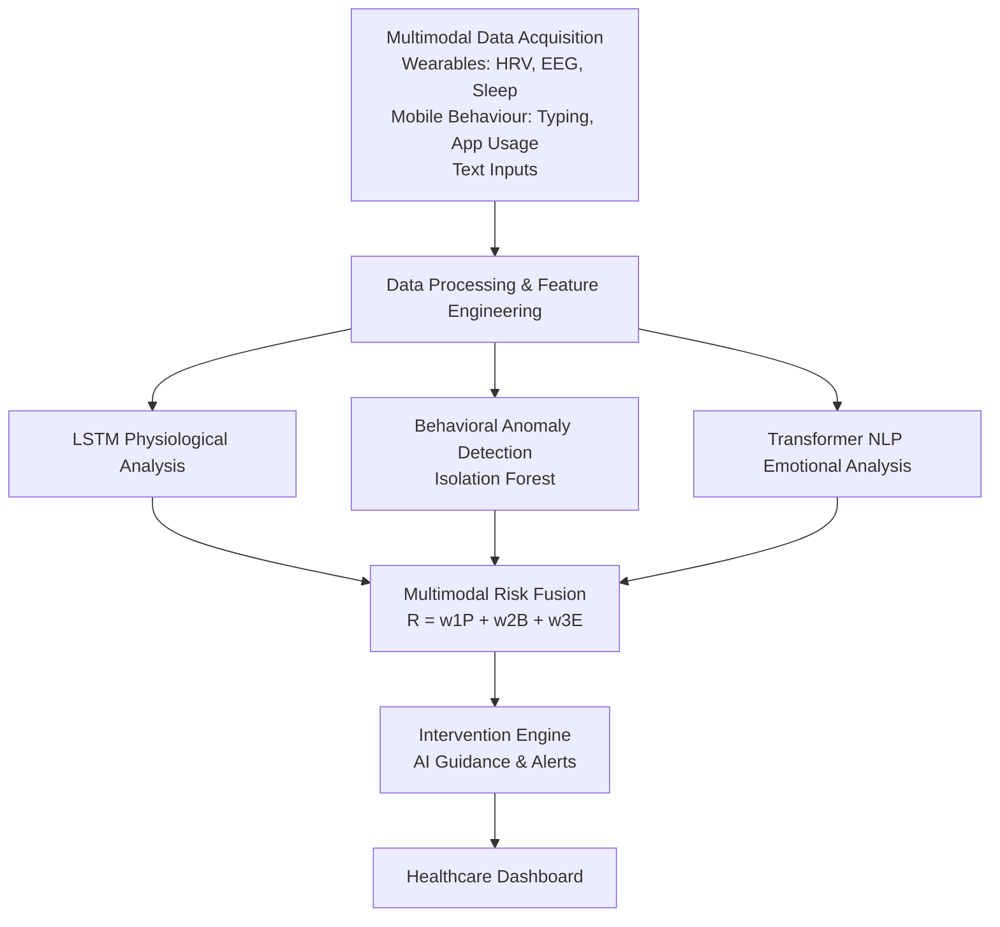

# AI-Based Mental Health Monitoring System Architecture

```mermaid
flowchart TB

A[Multimodal Data Acquisition
Wearables: HRV, EEG, Sleep
Mobile Behaviour: Typing, App Usage
Text Inputs]

B[Data Processing & Feature Engineering]

C1[LSTM Physiological Analysis]

C2[Behavioral Anomaly Detection
Isolation Forest]

C3[Transformer NLP Emotional Analysis]

D[Multimodal Risk Fusion
R = w1P + w2B + w3E]

E[Intervention Engine
AI Guidance & Alerts]

F[Healthcare Dashboard]

A --> B
B --> C1
B --> C2
B --> C3
C1 --> D
C2 --> D
C3 --> D
D --> E
E --> F
```
